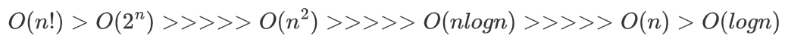

# Algorithm

유한한 단계를 통해 문제를 해결하기 위한 절차나 방법

 

### 표현 방법

* Pseudocode
* flowchart

### 좋은 알고리즘의 지표

* 정확성
* 연산량
* 메모리 사용량
* 단순성
* 최적성

### 성능 분석

* 시간복잡도(Time Complexity)
  * 실행되는 명령문의 개수를 계산 (작업량)
  * 실행시간 측정
  
* 빅-오 표기법(Big-Oh Notation)

  * 시간 복잡도 함수 중에서 가장 큰 영향력을 주는 n에 대한 항만을 표시
  * 계수는 생략

