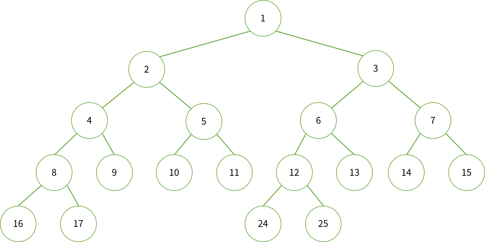
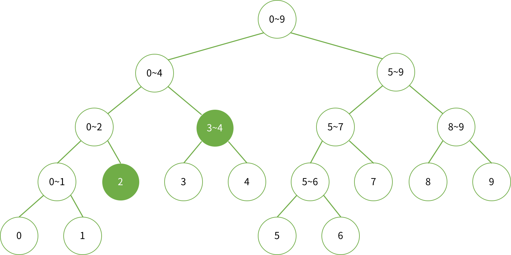
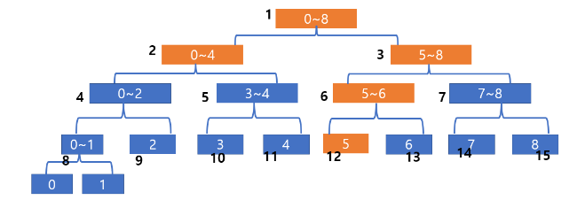
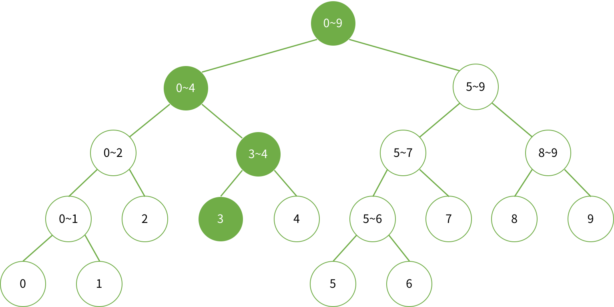

# Segment Tree (구간 트리)

어떤 데이터가 존재할 때 특정 구간의 결과값을 구하는데 사용하는 자료구조로, 
단순 구간합 뿐만 아니라 주어진 쿼리에 대해 빠르게 응답하기 위해 사용한다.

<br>


### 특징

* 장점
  - 선형 탐색보다 효율적인 탐색
  - 누적 합의 경우, 
    - array : `O(N)`
    - segment tree : `O(logN)`
      - worst case : `O(NlogN)`

* 단점
  - 많은 메모리 사용


### 구조

- Binary Tree(이진 트리)

- 구현할 배열 크기
  - Full Binary Tree의 경우
    - 높이 : `logN`
    - 노드 개수 : `2 ** (H+1)`
  - N이 2의 제곱근이 아닌 경우
    - 높이 H : `ceil(logN)`
    - 노드 개수 : `2 ** (H+1) - 1`
  - 보통 leaf node 수 * 4 크기 사용


* 노드 값
  * 리프 노드 : 배열의 그 수 자체
  * 다른 노드 : 왼쪽 자식과 오른쪽 자식의 합
  * N=10 인 경우 세그먼트 트리
    

* 노드 번호
  

#### 구현

```python
from math import ceil, log
leaf = [1, 2, 3, 4, 5, 6, 7, 8, 9, 10]
H = ceil(log(len(leaf), 2))  # tree height
tree_size = pow(2, H+1) - 1
segment_tree = [0] + [0] * tree_size
```

### Tree 생성

- 좌측 노드 : 좌표 = `node*2`,    구간 = `[left, mid]`
- 우측 노드 : 좌표 = `node*2+1`,  구간 = `[mid+1, right]`
- 현재 노드 : 좌표 = `node`,      구간 = `[left, right]`,     값 = 좌측노드 + 우측노드

위 3개 좌표를 사용하여 범위를 반으로 나누며 연산을 노드에 저장
구간 길이가 1이라면 (`left==right`), 트리에 자기자신을 저장 => leaf

#### 구현

```python
def segment(left, right, i):
    """
    left, right => leaf node 구간의 시작, 끝 (0, len(leaf)-1 로 시작)
    i => tree node 번호 (1로 시작)
    """
    if left == right:
        segment_tree[i] = leaf[left]
        return segment_tree[i]
    mid = (left+right) // 2
    segment_tree[i] = segment(left, mid, i*2) + segment(mid+1, right, i*2+1)
    return segment_tree[i]

segment(0, len(leaf)-1, 1)
print(segment_tree)
# [0, 55, 15, 40, 6, 9, 21, 19, 3, 3, 4, 5, 13, 8, 9, 10, 1, 2, 0, 0, 0, 0, 0, 0, 6, 7, 0, 0, 0, 0, 0, 0]

```


### 합 구하기

* 구간 `left, right`가 주어졌을 때, 루트부터 트리를 순회하며 각 노드가 담당하는 구간과 `left, right` 사이의 관계를 살핌
* ex) 2~4까지의 합을 구하는 경우
  
* node가 담당하는 구간이 `[start, end]` 이고, 합을 구해야 하는 구간이 `[left, right]`라면, 다음과 같이 4가지 경우로 나뉨
  1. `[left, right]`와 `[start, end]`가 겹치지 않는 경우
  2. `[left, right]`가 `[start, end]`를 완전히 포함하는 경우
  3. `[start, end]`가 `[left, right]`를 완전히 포함하는 경우
  4. `[left, right]`와 `[start, end]`가 겹쳐져 잇는 경우 (1, 2, 3을 제외한 나머지 경우)


#### 구현

- 아래 조건을 생각하며 분기
    1) 요청 구간이 노드 구간에 벗어난 경우 
        -> `retun 0`
    2) 요청 구간이 노드 구간을 완전히 포함한 경우 
        -> `return 트리 좌표 값`
    3) 노드 구간이 요청 구간을 완전히 포함한 경우 
        -> 요청 구간 외의 잉여 구간 배제해야 하므로 절반씩 나눠 재귀 탐색
    4) 요청 구간이 노드 구간에 걸쳐진 경우
        -> 3)과 같이 더 깊이 탐색해서 요청 외 잉여 구간 배제

```python
def query_sum(start, end, idx, left, right):
    """
    start, end => 현재 leaf node 포용 범위의 시작, 끝 (0, len(leaf)-1 로 시작)
    idx => 현재 tree node (1로 시작)
    left, right => 쿼리로 요청받은 leaf 범위의 시작, 끝
    """
    if left > end or right < start:
        return 0
    if left <= start and right >= end:
        return segment_tree[idx]
    mid = (start + end) // 2
    return query_sum(start, mid, idx*2, left, right) + query_sum(mid+1, end, idx*2+1, left, right)

print('sum 0 to 5 :', query_sum(0, len(leaf)-1, 1, 0, 5))
# sum 0 to 5 : 21
```


- 0~5번 합의 실행 예시
  1. 루트 노드 (1번)는 0~8까지의 정보를 담고 있고, 우리가 구해야 하는 0-5번을 포함하면서 더 크기 때문에 절반을 나눠준다.
  2. 0-4는 완전 포함되므로 2번 노드의 값을 리턴한다.
  3. 5-8의 경우는 관심 구간을 포함 중이므로 다시 쪼개주고, 5-6도 관심 구간을 포함하므로 쪼개준다.
  4. 이후 12번 노드의 값 (5)을 리턴한다.


### 수 변경하기

* 중간에 어떤 수를 변경한다면, 그 숫자가 포함된 구간을 담당하는 노드를 모두 변경해야 함
* ex) 3번째 수를 변경할 시, 변경이 필요한 구간
  
* 순서
  * `index` 번째 수를 `val`로 변경하면, 그 수가 얼만큼 변했는지 알아야 함
    * 이 수를 `diff`라고 하면, `diff = val - a[index]` 로 쉽게 구할 수 있음
  * node의 구간에 포함되는 경우에는 `diff`만큼 증가시켜 합을 변경
    * `tree[node] = tree[node] + diff`
    * 포함되지 않는 경우, 그 자식도 `index`가 포함되지 않으므로 탐색 중단
* 2가지 경우 존재
  1. `[start, end]`에 `index`가 포함되는 경우
  2. `[start, end]`에 `index`가 포함되지 않는 경우

#### 구현

- 재귀로 업데이트
- 함수의 인자로 원래 값과의 차이만 넣어서, 루트 노드부터 아래로 내려오면서 값을 업데이트
    1. 현재 노드 구간에 업데이트 노드가 없는 경우, `return`
    2. 아니라면 변경 값만큼 +
    3. leaf 노드가 아니라면 다시 자식 노드 탐색. 리프 노드라면 `return`

```python 
def update(start, end, node, idx, val):
    """
    start, end => 현재 leaf node 포용 범위의 시작, 끝 (0, len(leaf)-1 로 시작)
    node => 현재 tree node
    idx, val => 변경할 leaf node의 번호 및 변경 값(차분)
    """
    if start > idx or idx > end:
        return 
    segment_tree[node] += val
    if start == end:
        return
    mid = (start + end) // 2
    update(start, mid, node*2, idx, val)
    update(mid+1, end, node*2+1, idx, val)

print('sum 0 to 5 :', query_sum(0, len(leaf)-1, 1, 0, 5))
update(0, len(leaf)-1, 1, 0, 2)
print('sum 0 to 5 :', query_sum(0, len(leaf)-1, 1, 0, 5))
print(segment_tree)
# sum 0 to 5 : 21
# sum 0 to 5 : 23
# [0, 57, 17, 40, 8, 9, 21, 19, 5, 3, 4, 5, 13, 8, 9, 10, 3, 2, 0, 0, 0, 0, 0, 0, 6, 7, 0, 0, 0, 0, 0, 0]
```