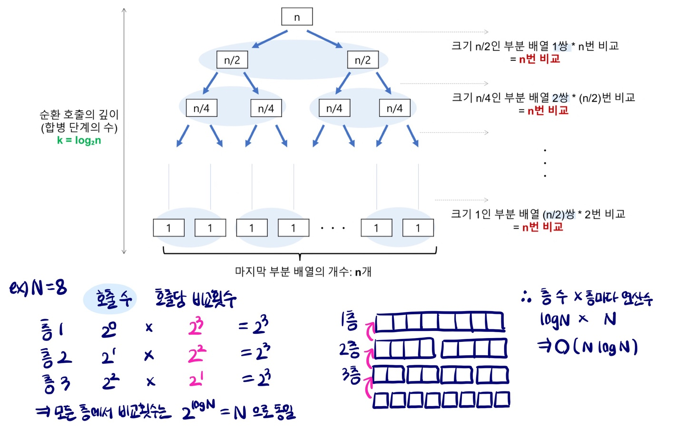

# Sort

2개 이상의 자료를 특정 기준에 의해 작은 값부터 큰 값(ascending), 혹은 그 반대의 순서대로 (descending) 재배열 하는 것

<br>

### Bubble Sort

* 인접한 두 개의 원소를 비교하며 자리를 계속 교환하는 방식
* 가장 큰 원소를 맨 마지막으로 밀어내는 단계를 반복한다.
* 시간복잡도 : O(n^2)

```python
def BubbleSort(lst):
    """
    탐색 범위(range(i))를 한 칸 씩 뒤에서부터 줄인다.
    
    :param lst: 정렬할 리스트
    :return: (오름차순) 정렬된 리스트
    """
    for i in range(len(lst) - 1, 0, -1):
        for j in range(i):
            if lst[j] > lst[j + 1]:
                lst[j], lst[j + 1] = lst[j + 1], lst[j]
    return lst
```

<br>

### Counting Sort

* 항목들의 순서를 결정하기 위해 집합에 각 항목이 몇 개씩 있는지 세는 작업을 하여, 선형 시간에 정렬하는 효율적인 알고리즘
* 정수나 정수로 표현할 수 있는 자료에 대해서만 적용 가능
* 시간복잡도 : O(n + k) - n은 리스트 길이. k는 정수의 최대값

```python
def CountingSort(lst):
    """
    각 항목의 발생 횟수를 counts 배열에 저장하고, 누적합을 이용해 각 항목을 알맞은 위치에 저장한다.

    :param lst: 정렬할 리스트
    :return: (오름차순) 정렬된 리스트
    """
    counts = [0] * (max(lst) + 1)
    sorted_lst = [0] * len(lst)

    # 각 숫자가 몇 개 들어있는지
    for n in lst:
        counts[n] += 1

    # 각 숫자의 마지막 원소의 위치
    for k in range(1, len(counts)):
        counts[k] += counts[k - 1]

    # 리스트를 돌며 알맞은 위치에 저장
    for n in lst:
        counts[n] -= 1
        sorted_lst[counts[n]] = n

    return sorted_lst
```

<br>

### Selection Sort

* 주어진 자료들 중 가장 작은 값의 원소부터 차례대로 선택하여 위치를 교환하는 방식
* 시간복잡도 : O(n^2)

```python
def SelectionSort(lst):
    """
    탐색 범위를 한 칸씩 앞에서부터 줄이며, 최소값을 맨 앞으로 보낸다.
    
    :param lst: 정렬할 리스트
    :return: (오름차순) 정렬된 리스트
    """
    for i in range(len(lst) - 1):
        min = i
        for j in range(i + 1, len(lst)):
            if lst[min] > lst[j]:
                min = j
        lst[i], lst[min] = lst[min], lst[i]

    return lst
```

<br>

### Merge Sort

* 하나의 배열을 절반으로 나눈 후, 각 작은 배열을 재귀적으로 정렬하고, 그 결과를 Merge 한다.
* 시간복잡도 : O(nlogn)

```python
def MergeSort(lst):
    """
    반으로 나눠 정렬하고, 정렬된 두 리스트를 합친다.

    :param lst: 정렬할 리스트
    :return: (오름차순) 정렬된 리스트
    """
    if len(lst) <= 1:
        return lst

    mid = len(lst)//2
    left = MergeSort(lst[:mid])
    right = MergeSort(lst[mid:])

    return merge(left, right)


def merge(left, right):
    """
    두 리스트의 맨 앞부터 비교해가며 작은 수를 결과 리스트레 저장한다.

    :param left: 정렬된 리스트 1
    :param right: 정렬된 리스트 2
    :return: 두 리스트가 합쳐져 정렬된 리스트
    """
    sorted_lst = []
    i = 0
    j = 0

    while i < len(left) and j < len(right):
        if left[i] < right[j]:
            sorted_lst.append(left[i])
            i += 1
        else:
            sorted_lst.append(right[j])
            j += 1

    while i < len(left):
        sorted_lst.append(left[i])
        i += 1

    while j < len(right):
        sorted_lst.append(right[j])
        j += 1

    return sorted_lst
```



