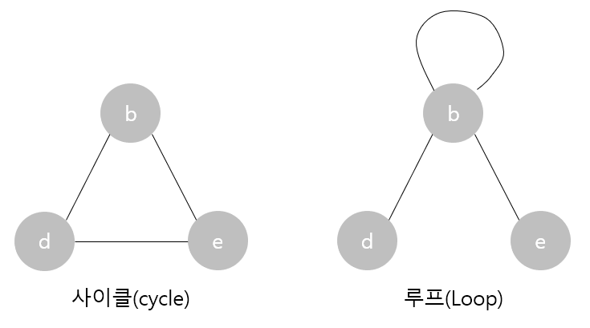
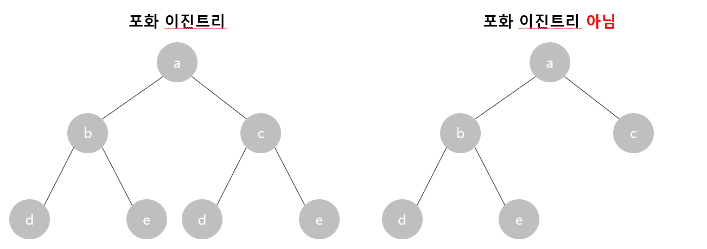
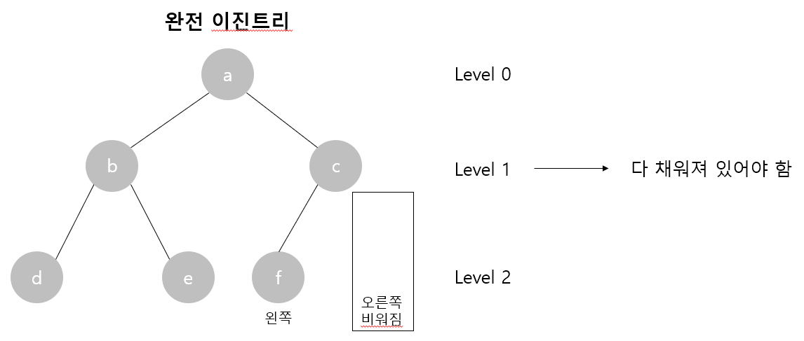
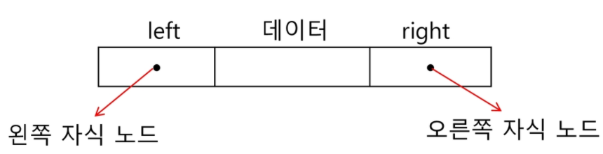

# Tree

상위 원소에서 하위 원소로 내려가면서 확장되는 (계층형) 1대다 비선형 구조

<br>

### 이진트리

* 모든 노드들이 2개의 서브트리를 갖는 특별한 형태의 트리
* 레벨 i에서 노드의 최대 개수는 2^i 개
* 높이 h인 이진 트리가 가질 수 있는 노드의 최소 개수는 h+1 개이며, 최대 개수는 2^(h+1)-1 개 이다.

#### 특징

* 루트 노드는 하나이다.
* 트리에는 사이클 및 루프가 존재할 수 없다. (시작 노드에서 출발해 다시 돌아올 수 있으면 사이클이 존재한다고 함)

  

#### 종류

* 포화 이진 트리 (Full Binary Tree)

  

  * 모든 레벨에 노드가 포화 상태로 차있는 트리
  * root를 1번으로 하여 2^(h+1)-1까지 정해진 위치에 대한 노드 번호를 가짐   

* 완전 이진 트리 (Complete Binary Tree)

  

  * 포화 이진 트리의 노드 번호 1번부터 n번까지 빈 자리가 없는 이진 트리 (h+1 <= n < 2^(h+1)-1)
  * 노트는 왼쪽에서 오른쪽으로 채워져야 한다.   

* 편향 이진 트리 (Skewed Binary Tree)

  * 높이 h에 대한 최소 개수의 노드를 가지면서 한쪽 방향의 자식 노드만을 가진 이진 트리

#### 순회 (traversal)

트리의 노드들을 체계적으로 중복되지 않게 전부 방문하는 것

* 전위 순회 (preorder traversal)
  * 부모노드 방문 후, 자식노드를 좌, 우 순서로 방문한다.
  * 순회를 시작한 정점을 루트로 하는 서브트리 내에서만 순회한다.

* 중위 순회 (inorder traversal)

  * 왼쪽 자식노드, 부모노드, 오른쪽 자식노드 순으로 방문한다.

* 후위 순회 (postorder traversal)

  * 자식노드를 좌우 순서로 방문한 후, 부모노드로 방문한다.

* 구현

  ```python
  # 1. 전위 순회 : VLR
  def preorder_traverse(v):
      if v in range(1, V + 1):
          print(v, end=' ')
          preorder_traverse(left[v])
          preorder_traverse(right[v])
  
  # 2. 중위 순회 : LVR
  def inorder_traverse(v):
      if v in range(1, V + 1):
          inorder_traverse(left[v])
          print(v, end=' ')
          inorder_traverse(right[v])
  
  # 3. 후위 순회 : LRV
  def postorder_traverse(v):
      if v in range(1, V + 1):
          postorder_traverse(left[v])
          postorder_traverse(right[v])
          print(v, end=' ')
  
  
  # 정점의 갯수와 간선 리스트를 받고, 트리 생성
  V = 13
  edges = [1, 2, 1, 3, 2, 4, 3, 5, 3, 6, 4, 7, 5, 8, 5, 9, 6, 10, 6, 11, 7, 12, 11, 13]
  E = V - 1
  left = [0] * (V + 1)
  right = [0] * (V + 1)
  par = [0] * (V + 1)     # 0인 인덱스: root
  for i in range(E):
      p = edges[2*i]
      c = edges[2*i + 1]
      if not left[p]:
          left[p] = c
      else:
          right[p] = c
      par[c] = p
  
  
  # 전위 순회, 중위 순회, 후위 순회 순서로 출력
  print('전위 순회')
  preorder_traverse(1)
  print('\n중위 순회')
  inorder_traverse(1)
  print('\n후위순회')
  postorder_traverse(1)
  
  # 6의 조상 찾기 (부모부터 root 까지)
  print('\n조상 찾기')
  c = 6
  while par[c]:
      print(par[c], end=' ')
      c = par[c]
      
  '''
  [출력]
  전위 순회
  1 2 4 7 12 3 5 8 9 6 10 11 13 
  중위 순회
  12 7 4 2 1 8 5 9 3 10 6 13 11 
  후위순회
  12 7 4 2 8 9 5 10 13 11 6 3 1 
  조상 찾기
  3 1
  '''
  ```

####  표현

* 배열

  * 레벨 n에 있는 노드에 대해 왼쪽부터 오른쪽으로 2^n 부터 2^(n+1)-1 까지 번호를 차례로 부여
  * 편향 이진 트리의 경우 사용하지 않는 배열 원소에 대한 메모리 공간 낭비 발생
  * 트리 중간에 새로운 노드를 삽입하거나 기존의 노드를 삭제할 경우 배열의 크기 변경 어려워 비효율적

* 연결 리스트

  * 이진트리의 모든 노드는 최대 2개의 자식 노드를 가지므로, 일정한 구조의 단순 연결 리스트 노드를 사용하여 구현

  

#### 수식 트리 (Expression Binary Tree)

* 연산자는 루트 노드이거나 가지 노드
* 피 연산자는 모두 잎 노드

<br>

### 이진 탐색 트리

* 탐색 작업을 효율적으로 하기 위한 자료구조
* 모든 원소는 서로 다른 유일한 키를 갖는다.
* key(왼쪽 서브트리) < key(루트 노드) < key(오른쪽 서브트리)
* 왼쪽 서브트리와 오른쪽 서브트리도 이진 탐색 트리다.

* 시간복잡도 : 평균적으로 O(log n)의 성능, 최악의 경우 O(n)

<br>

### 힙 (Heap)

완전 이진 트리에 있는 노드 중에서 키값이 가장 큰 노드나 키값이 가장 작은 노드를 찾기 위해 만든 자료구조

* 힙(heap)의 키(key)를 우선순위(priority)로 사용하면, 우선순위 큐(priorty queue)의 구현체로 사용 가능
* 일반적으로 배열을 이용하여 구현

#### 최소 힙 (min heap)

* 키값이 가장 작은 노드를 찾기 위한 완전 이진 트리
* {부모노드의 키값 < 자식노드의 키값}
* 루트 노드 : 키값이 가장 작은 노드
* 구현

  ```python
  # python에서 제공하는 최소 힙 라이브러리 (heqpq)
  #   heapq.heappush(heap, item) : item을 heap에 추가
  #   heapq.heappop(heap) : heap에서 가장 작은 원소를 pop & return. 비어있는 경우 IndexError 호출
  #   heapq.heapify(lst) : list를 heap으로 변환 (O(N))
  import heapq

  def heapsort(iterable):
    h = []
    result = []

    # 모든 원소 삽입
    for value in iterable:
      heapq.heappush(h, value)

    # 모든 원소 꺼내기
    for _ in range(len(h)):
      result.append(heapq.heappop(h))
    
    return result

  arr = [3, 2, 5, 4, 7, 1]
  res = heapsort(arr)
  print(res)  # [1, 2, 3, 4, 5, 7]
  ```

#### 최대 힙 (max heap)

* 키값이 가장 큰 노드를 찾기 위한 완전 이진 트리
* {부모노드의 키값 > 자식노드의 키값}
* 루트 노드 : 키값이 가장 큰 노드
* 구현

  ```python
  import heapq

  def heapsort(iterable):
    h = []
    result = []

    # 모든 원소 삽입 (가짜 순위, 실제 순위)
    # -> 가짜 순위를 기준으로 최소 힙 구성
    for value in iterable:
      heapq.heappush(h, (-value, value))

    # 모든 원소 꺼내기 (실제 순위만 append)
    for _ in range(len(h)):
      result.append(heapq.heappop(h)[1])
    
    return result

  arr = [3, 2, 5, 4, 7, 1]
  res = heapsort(arr)
  print(res)  # [7, 5, 4, 3, 2, 1]
  ```

#### 최소 힙 (우선순위 큐)의 데이터 삽입/삭제

* 삽입

  1. 새 노드를 마지막 노드 뒤에 추가
  2. 새 노드와 부모 노드의 키값을 비교해서 부모 노드보다 키값이 작으면 위치 교환
  3. 정상적인 힙트리가 될 때까지 (더이상 부모 노드와 교환할 필요가 없을 때) 2. 반복

* 삭제

  1. 루트 노드를 반환
  2. 마지막 노드를 루트 노드 자리로 이동
  3. 새로운 루트 노드의 좌/우 자식 노드 중 키값이 작은 값과 비교하며 위치 교환
  4. 정상적인 힙트리가 될 때까지 (더이상 자식 노드와 교환할 필요가 없을 때) 3. 반복

* worst case
    * 루트 노드 or 마지막 노드까지 비교하며 올라가는 경우, O(log_2 n) 